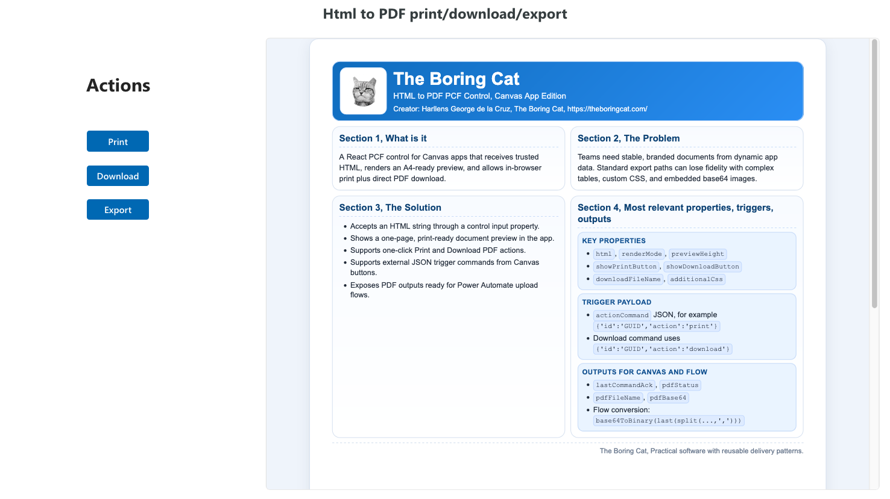
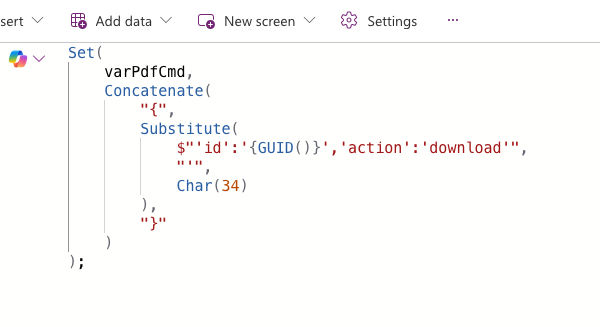
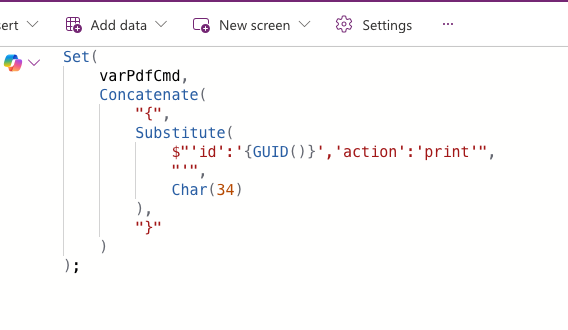

# HTML to PDF Converter PCF

Power Apps PCF control for Canvas apps that renders trusted HTML with an inline preview and supports:
- Print (browser print dialog / Save as PDF)
- Download PDF directly in the browser (no Power Automate required)
- Export PDF as Base64 for external data sources (for example SharePoint via Power Automate)
- Canvas-triggered action commands (`print`, `download`)


## Visual preview

### Inline preview + controls

PCF rendering:



PCF properties (Canvas app):


### Download PDF action command (Canvas trigger)

Example action command payload from Canvas:



### Print action command (Canvas trigger)

Example action command payload from Canvas:



## What this PCF supports

- `renderMode=inline` (default) with iframe preview
- `renderMode=popup` (legacy popup print flow)
- **Print** action using browser-native print dialog
- **Download PDF** action using client-side rendering (`html2canvas` + `pdf-lib`)
- **Base64 PDF output** (`pdfBase64`) for downstream use (SharePoint, external systems, Flow)
- Canvas command input via `actionCommand` JSON and acknowledgment via `lastCommandAck`
- HTML outputs (`htmlText`, `htmlTextRaw`) for diagnostics
- Base64 image support (recommended for reliable client-side rendering)
- Line-break token replacement (`lineBreakToken`) and page-marker `div` support for PDF segmentation

## Important behavior notes

- **Download without Power Automate:** supported. Users can click the built-in Download button (or trigger `download` with `actionCommand`) to save a PDF locally.
- **Export as Base64 for SharePoint / external data sources:** supported via `pdfBase64`, `pdfFileName`, and `pdfStatus` outputs.
- **Images:** supported as **base64 data URIs**. This is the recommended approach for v1 to avoid CORS/DLP issues.
- **Line breaks vs page breaks:**
  - line breaks are handled with the configurable `lineBreakToken` (default `<!-- linebreak -->`) and converted to `<br />`
  - page boundaries are handled with marker `div`s such as `id="page"` or `id="page-2"`

## Quickstart (local PCF test harness)

```bash
cd pcf/HtmlPdfPrintButton
npm install
npm run refreshTypes
npm run build
npm run start
```

Then paste HTML into the `html` property in the PCF harness and test:
- Print flow
- Download flow
- `actionCommand` triggers
- page-marker `div` segmentation

## Build the Dataverse solution (managed/unmanaged)

This repository includes the solution packaging project and version-bump script required to build importable Dataverse solution zip files.

```bash
dotnet build solution/Html_to_PDF_Component_Solution/Html_to_PDF_Component_Solution.cdsproj -c Release
```

Managed-only build:

```bash
dotnet build solution/Html_to_PDF_Component_Solution/Html_to_PDF_Component_Solution.cdsproj -c Release /p:SolutionPackageType=Managed
```

Outputs are generated under:

- `solution/Html_to_PDF_Component_Solution/bin/Release/`

## Canvas action commands

Use the `actionCommand` input to trigger actions from Canvas buttons.

Supported payload format:

```json
{"id":"<guid>","action":"print|download"}
```

Power Fx examples:

```powerfx
Set(
    varPdfCmd,
    Concatenate(
        "{",
        Substitute(
            $"'id':'{GUID()}','action':'print'",
            "'",
            Char(34)
        ),
        "}"
    )
);
```

```powerfx
Set(
    varPdfCmd,
    Concatenate(
        "{",
        Substitute(
            $"'id':'{GUID()}','action':'download'",
            "'",
            Char(34)
        ),
        "}"
    )
);
```

Notes:
- Use a new `id` for each click so repeated commands are detected.
- `download` command is supported in `renderMode=inline`.
- In `renderMode=popup`, command support is print-only.

## Export PDF Base64 to SharePoint (Power Automate)

This PCF can return the generated PDF as Base64 so your Canvas app can pass it to a Flow.

Typical pattern:
- Wait for `pdfStatus = "ready"`
- Send `pdfFileName` and `pdfBase64` to your Flow
- In Flow, convert Base64 to binary before creating the SharePoint file

See full usage details in `docs/pcf-usage.md`.

## Documentation

- [PCF usage guide](docs/pcf-usage.md) - properties, outputs, action commands, Flow contract
- [Solution packaging guide](docs/solution-package.md) - build/import steps and managed/unmanaged outputs
- [Screenshots and media](docs/media/) - images used in this README

## Creator

Harllens George de la Cruz, The Boring Cat  
https://theboringcat.com/

## License

Apache-2.0 (see `LICENSE`).
